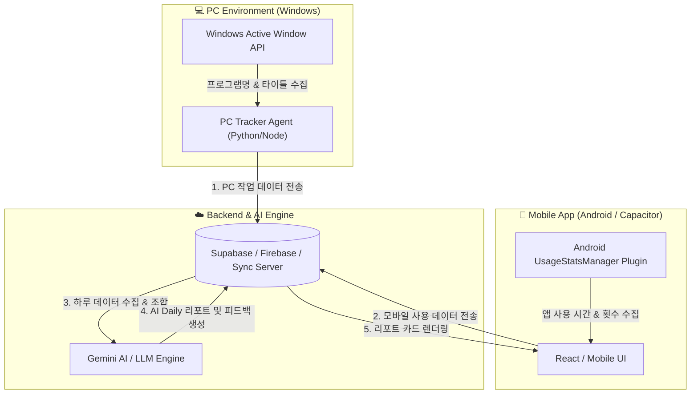

# 📊 Digital-Life AI Log (PC + 모바일 통합 작업 일지 & AI 루틴 코너) 구현 계획서

본 시스템은 사용자의 **PC 작업 내역(프로그램 사용 시간, 작업 내용)**과 **스마트폰 사용 내역(앱별 사용 시간, 켜짐 횟수)**을 백그라운드에서 자동으로 수집하여, 저녁마다 AI가 **일일 종합 리포트**와 **개인 맞춤형 생활 루틴 피드백**을 제공하는 자동화 시스템입니다.

---

## 🏗️ 1. 전체 시스템 아키텍처 (System Architecture)

---

## 🛠️ 2. 세부 구성 요소 및 주요 기능

### 💻 1) PC Activity Tracker Agent
* **역할**: 백그라운드에서 실행되며 사용자가 어떤 프로그램을 얼마나 사용했는지 수집
* **수집 데이터**:
  * 프로세스명 (예: `chrome.exe`, `Code.exe`, `photoshop.exe`)
  * 창 제목 (예: `[VS Code] App.tsx - OnDa_App`, `[Chrome] 유튜브 시청`)
  * 해당 창의 활성화 지속 시간 (초 단위)
  * 키보드/마우스 유휴 시간(Idle time) ➔ 자리를 비운 시간은 자동 제외
* **구현 기술**: Python (`pygetwindow`, `psutil`, `pynput`) 기반의 Windows System Tray 프로그램

### 📱 2) Mobile Usage Collector & UI App
* **역할**: 스마트폰 내 앱 사용량 측정 및 최종 AI 리포트/캘린더 뷰 제공
* **수집 데이터**:
  * 앱 패키지별 사용 시간 (예: 유튜브 1.5시간, 카카오톡 45분, 인스타그램 30분)
  * 화면 해제 횟수 (Unlock count) 및 시간대별 사용 분포
* **핵심 화면 구성**:
  * **[오늘의 AI 리포트]**: AI 갓생 총평, 칭찬 포인트, 주의할 도파민 패턴, 내일의 루틴 제안 카드
  * **[타임라인/상세 통계]**: PC 작업 vs 모바일 사용 비율 파이차트 및 시간대별 그래프
  * **[AI 코칭 톤 설정]**: 다정한 코치 / 직설적인 팩폭 모드 / 칭찬봇 모드 선택
  * **[리포트 캘린더]**: 날짜별 일지 모아보기 및 PDF/이미지 저장

### ☁️ 3) 데이터 동기화 & AI 리포트 생성 엔진
* **데이터 통합 파이프라인**:
  1. 매일 밤 지정된 시각(예: 23시) 또는 사용자가 "오늘의 리포트 생성" 버튼 클릭 시 작동
  2. PC 데이터와 모바일 데이터를 일 단위로 병합 및 구조화(JSON)
  3. AI 프롬프트 생성 후 Gemini API 호출
* **개인정보 보호 고려 (Privacy First)**:
  * 금융 앱, 개인 메신저 내용 등 민감한 제목/URL은 마스킹(`[비밀화]`) 처리 후 AI로 전달
  * 모든 raw 데이터는 본인 계정 DB에만 암호화 저장

---

## 📋 3. 단계별 개발 로드맵 (Implementation Steps)

### 1단계: PC Activity Tracker 에이전트 개발
- Python 기반 백그라운드 수집 스크립트 작성
- 유휴 시간(Idle Time) 판별 알고리즘 적용 및 일 단위 JSON 변환 기능 탑재

### 2단계: 모바일 앱 Native Plugin 연동 (Android UsageStats)
- Capacitor / React Native용 Android `UsageStatsManager` 래퍼 작성
- 앱별 사용 시간 및 실행 횟수 데이터 파싱

### 3단계: 백엔드 동기화 및 Gemini AI 연동
- Supabase 또는 로컬 동기화 기반 데이터 수집 서버 구축
- AI 프롬프트 엔지니어링 (생산성 지수 계산, 개선 루틴 추천 템플릿 설계)

### 4단계: 모바일 앱 대시보드 UI & 캘린더 개발
- 대시보드 리포트 카드 UI 디자인 및 애니메이션 적용
- 캘린더 탭 및 상세 분석 차트 구현

---

## 🧪 4. 검증 및 테스트 계획 (Verification Plan)

### 백엔드 & 에이전트 검증
- PC 5분 유휴 상태 시 작업 시간 카운트가 자동 정지되는지 검증
- Android 권한(사용 정보 접근 허용) 획득 및 정상 데이터 반환 여부 검증

### AI 리포트 검증
- 정상적인 PC+모바일 데이터 입력 시 AI 가 정해진 템플릿(칭찬/주의/루틴제안)대로 응답하는지 검증
- 민감 텍스트(패스워드 입력창 등) 마스킹 처리 유무 확인

---

## ❓ 사용자 반영 피드백 및 설계 최적화
> [!IMPORTANT]
> 1. **AI 코치 모드 & 강도 (Intensity) 선택 옵션**:
>    - 3단계 강도 조절 지원: `🌱 1단계: 순한맛 (다정한 격려)` ➔ `⚖️ 2단계: 보통 (밸런스 분석)` ➔ `🌶️ 3단계: 매운맛 (현실적인 팩폭 코치)`
> 2. **Zero-Cost (무료) 하이브리드 데이터 동기화**:
>    - 기본: 동일 Wi-Fi 망 내 **로컬 직접 통신(mDNS/HTTP)** ➔ 별도 서버 비용 0원
>    - 예외/외부: Supabase / Firebase의 **100% 무료 요금제(Free Tier)** 범주 내에서만 원격 동기화
> 3. **현대인 현실에 맞춘 스마트 수면 & 루틴 코칭**:
>    - "폰을 거실에 두기" 대신 **"알람 설정 후 흑백 모드 자동 전환", "손이 안 닿는 책상 위 알람 설정", "저녁 10시 이후 숏폼 앱 잠금"** 등 실생활에 꼭 맞는 팁 제공.
